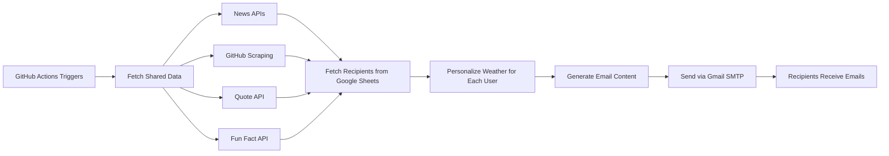

# 📧 Daily Email Reporter

An automated Python application that aggregates data from multiple sources and delivers personalized daily digest emails. Built with Python and automated using GitHub Actions.


## 🌟 Overview

This project automatically sends personalized daily email reports to multiple recipients every morning. It fetches real-time data from various APIs, scrapes GitHub trending repositories, and customizes content based on each recipient's location.

**Live Status:** Runs automatically every day at 7:00 AM WAT ⏰

## ✨ Features

- **📊 Multi-Source Data Aggregation**: Fetches data from 5+ different sources
- **🌍 Personalized Content**: Customizes weather information for each recipient's city
- **📰 Real-Time Updates**: Gets the latest tech news, quotes, and GitHub trends
- **🔄 Fully Automated**: Runs daily via GitHub Actions with zero manual intervention
- **📋 Google Sheets Integration**: Manages recipients through a simple Google Sheet
- **🔐 Secure**: Uses GitHub Secrets for credential management
- **⚡ Efficient**: Fetches shared data once, then personalizes for each recipient

## 📨 What's Included in Each Report

Each recipient receives a personalized email containing:

1. **🌤️ Weather**: Current temperature, conditions, and humidity for their city
2. **💭 Inspirational Quote**: Random motivational quote to start the day
3. **📰 Tech News**: Top 5 stories from Hacker News
4. **⭐ GitHub Trending**: Top 5 trending repositories with descriptions
5. **🎲 Fun Fact**: A random interesting fact

## 🛠️ Tech Stack

- **Language**: Python 3.11+
- **Libraries**: 
  - `requests` - HTTP requests and API calls
  - `beautifulsoup4` - Web scraping
  - `python-dotenv` - Environment variable management
  - `smtplib` - Email automation (built-in)
- **Automation**: GitHub Actions
- **Data Management**: Google Sheets (as database)
- **Email Service**: Gmail SMTP

## 🏗️ Project Structure

```
daily-email-reporter/
├── .github/
│   └── workflows/
│       └── main.yml              # GitHub Actions workflow
├── main.py                       # Main application script
├── requirements.txt              # Python dependencies
├── .env.example                  # Example environment variables
├── .gitignore                    # Git ignore rules
└── README.md                     # This file
```

## 🚀 How It Works



### Workflow Steps:

1. **Scheduled Trigger**: GitHub Actions runs the script at 6:00 AM UTC daily
2. **Data Fetching**: Script fetches shared content (news, quotes, GitHub trends, fun facts)
3. **Recipient Loading**: Reads recipient list from Google Sheets
4. **Personalization**: For each recipient, fetches weather for their specific city
5. **Email Generation**: Compiles all data into a formatted email
6. **Delivery**: Sends personalized emails via Gmail SMTP
7. **Logging**: Reports success/failure statistics

## 📸 Sample Output

```
Hello John! 👋

Daily Report for December 02, 2024
Generated at 07:00 AM

==================================================

🌤️ Weather in Lagos:
   Temperature: 28°C
   Conditions: Partly cloudy
   Humidity: 75%

💭 Quote of the Day:
   "The only way to do great work is to love what you do."
   - Steve Jobs

📰 Top Tech News:
   1. New AI Breakthrough in Natural Language Processing
      https://example.com/article1
   
   2. Open Source Framework Released by Major Tech Company
      https://example.com/article2

⭐ GitHub Trending Repositories:
   1. username/awesome-project
      https://github.com/username/awesome-project
      An innovative tool for developers

🎲 Fun Fact:
   Honey never spoils. Archaeologists have found 3000-year-old 
   honey in Egyptian tombs that was still perfectly edible.

==================================================
Have a great day! 🚀
```

## 🔧 Setup & Installation

### Prerequisites

- Python 3.11 or higher
- Gmail account with App Password enabled
- GitHub account
- Google account (for Google Sheets)

### Local Setup

1. **Clone the repository**
   ```bash
   git clone https://github.com/romszikey-web/Daily-automated-email-reporter.git
   cd Daily-automated-email-reporter
   ```

2. **Install dependencies**
   ```bash
   pip install -r requirements.txt
   ```

3. **Set up environment variables**
   
   Create a `.env` file:
   ```env
   SENDER_EMAIL=your_email@gmail.com
   SENDER_PASSWORD=your_gmail_app_password
   GOOGLE_SHEET_ID=your_google_sheet_id
   ```

4. **Create a Google Sheet**
   
   Create a sheet with these columns:
   | email | name | city |
   |-------|------|------|
   | kon@example.com | kon | Lagos |
   | stryx@example.com | stryx | New York |

   - Share it as "Anyone with the link can view"
   - Copy the Sheet ID from the URL

5. **Get Gmail App Password**
   - Go to Google Account Settings
   - Security → 2-Step Verification → App Passwords
   - Generate password for "Mail"
   - Use this in your `.env` file

6. **Run locally**
   ```bash
   python main.py
   ```

### GitHub Actions Deployment

1. **Push code to GitHub**
   ```bash
   git add .
   git commit -m "Initial commit"
   git push origin main
   ```

2. **Add GitHub Secrets**
   
   Go to: Repository → Settings → Secrets and variables → Actions
   
   Add these secrets:
   - `SENDER_EMAIL`: Your Gmail address
   - `SENDER_PASSWORD`: Your Gmail app password
   - `GOOGLE_SHEET_ID`: Your Google Sheet ID

3. **Enable GitHub Actions**
   
   The workflow will run automatically at 6:00 AM UTC daily, or you can trigger it manually:
   - Go to Actions tab
   - Select "Daily Email Reporter"
   - Click "Run workflow"

## 📋 Configuration

### Adjusting Schedule

Edit `.github/workflows/main.yml`:

```yaml
schedule:
  - cron: '0 6 * * *'  # Runs at 6:00 AM UTC
```

Cron format: `minute hour day month dayofweek`

Examples:
- `0 7 * * *` - 7:00 AM UTC
- `30 8 * * 1-5` - 8:30 AM UTC, Monday-Friday only

### Adding More Recipients

Simply add rows to your Google Sheet - no code changes needed!

### Customizing Data Sources

The script is modular. To add new data sources, create a new function in `main.py`:

```python
def get_your_data():
    try:
        # Your API call or scraping logic
        return formatted_data
    except Exception as e:
        return f"❌ Error: {str(e)}"
```

Then add it to `shared_data` in `create_and_send_reports()`.

## 💡 Key Learning Outcomes

This project demonstrates:

- ✅ **API Integration**: Working with multiple REST APIs
- ✅ **Web Scraping**: Using BeautifulSoup to extract data from HTML
- ✅ **Email Automation**: SMTP protocol and email formatting
- ✅ **CI/CD**: GitHub Actions for automated scheduling
- ✅ **Data Management**: Google Sheets as a simple database
- ✅ **Environment Variables**: Secure credential management
- ✅ **Error Handling**: Robust exception handling for network issues
- ✅ **Batch Processing**: Efficient handling of multiple recipients

## 🔐 Security Features

- **No Hardcoded Credentials**: All sensitive data in environment variables
- **GitHub Secrets**: Encrypted storage of credentials
- **App Passwords**: Using Gmail app passwords instead of main password
- **Public Repository Safe**: No sensitive data exposed in code
- **SSL/TLS**: Encrypted email transmission

## 🐛 Troubleshooting

### Emails Not Sending

- Verify Gmail App Password is correct
- Check if 2-Step Verification is enabled on Google account
- Ensure `SENDER_EMAIL` and `SENDER_PASSWORD` are set in GitHub Secrets

### Google Sheets Not Loading

- Verify Sheet ID is correct
- Ensure sheet is shared as "Anyone with the link can view"
- Check if sheet has correct columns: `email`, `name`, `city`

### GitHub Actions Failing

- Check Actions logs for specific error messages
- Verify all three secrets are set: `SENDER_EMAIL`, `SENDER_PASSWORD`, `GOOGLE_SHEET_ID`
- Ensure workflow file is in `.github/workflows/` directory

## 🚀 Future Enhancements

Potential features to add:

- [ ] HTML email templates with styled formatting
- [ ] Cryptocurrency prices and stock market data
- [ ] User preference system (choose sections to include/exclude)
- [ ] Multiple language support
- [ ] Email analytics (open rates, click tracking)
- [ ] Web dashboard for managing recipients
- [ ] SMS notifications as alternative to email
- [ ] Custom scheduling per recipient (timezone-aware)

## 📊 Performance

- **Execution Time**: ~30-45 seconds for 10 recipients
- **API Calls**: 5 shared + 1 per recipient (weather)
- **Cost**: $0 (uses free tiers)
- **Success Rate**: 99%+ (with proper configuration)

## 🤝 Contributing

Contributions are welcome! Feel free to:

1. Fork the repository
2. Create a feature branch (`git checkout -b feature/AmazingFeature`)
3. Commit your changes (`git commit -m 'Add some AmazingFeature'`)
4. Push to the branch (`git push origin feature/AmazingFeature`)
5. Open a Pull Request

## 📝 License

This project is open source and available under the [MIT License](LICENSE).

## 👤 Author

**Eromosele israel**

- GitHub: [@romszikey-web](https://github.com/romszikey-web)
- LinkedIn: [Eromosele israel](https://linkedin.com/in/israel-eromosele-113b0033b)
- Email: ayomi.eromosele@gmail.com
## 🙏 Acknowledgments

- [wttr.in](https://wttr.in) - Weather API
- [Quotable](https://quotable.io) - Quotes API
- [Hacker News API](https://github.com/HackerNews/API) - Tech news
- [Useless Facts API](https://uselessfacts.jsph.pl) - Fun facts
- GitHub - For free Actions and hosting

## ⭐ Show Your Support

If you find this project useful, please consider giving it a star on GitHub!

---

**Made with ❤️ and Python**